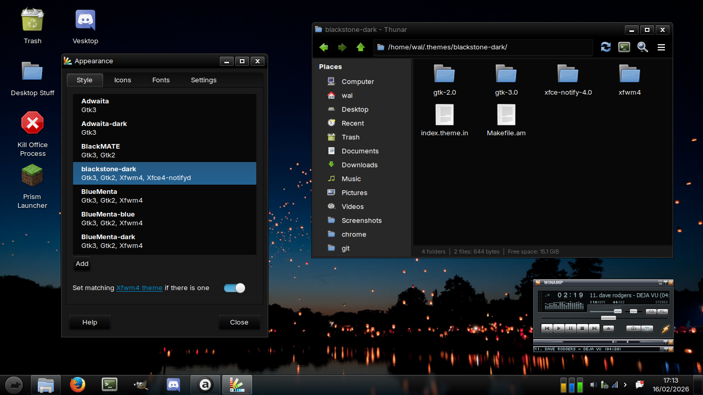
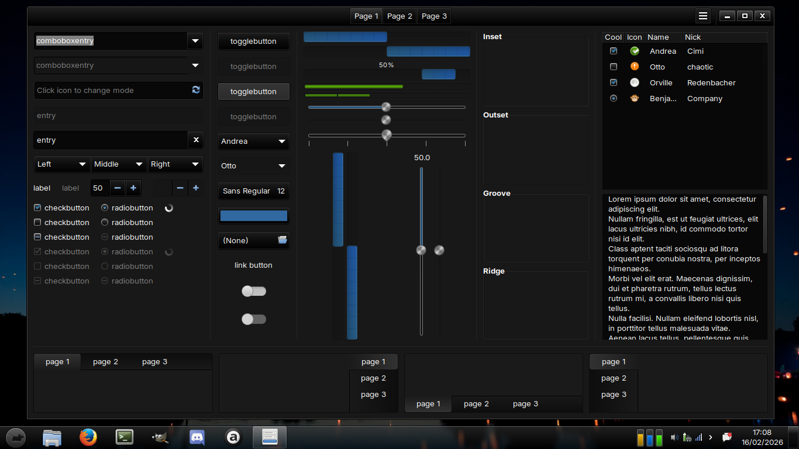
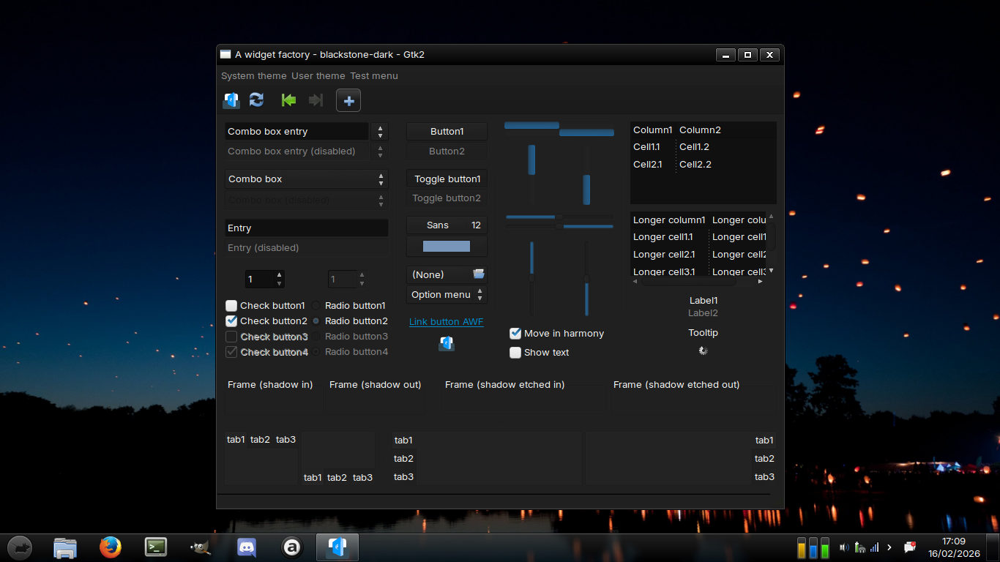

# xfce4-setup
My xfce4 setup/rice.

Notes:
- The icons are meant to be merged with [Tango2](https://www.pling.com/p/1180224/) icons.
- The theme is still work in progress and may results in unwanted visuals.
- Docklike plugin is used for this setup.

Screenshots:

GTK3 and GTK2 widgets:

